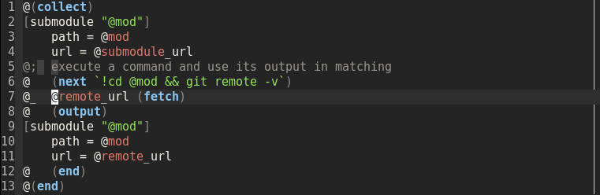

## Emacs mode for TXR language

It's very basic implementation, partly derived from a `tl.vim` from TXR source.
Right now it offers only syntax highlighting, which looks like this (with
`wombat` theme).

